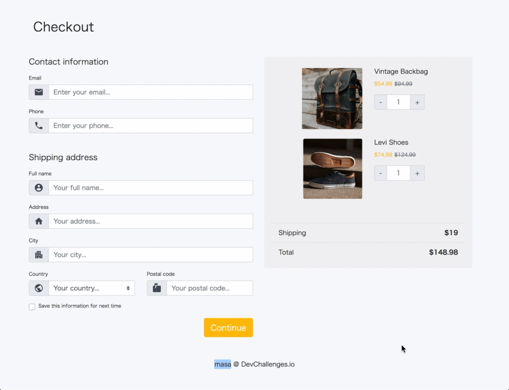

<!-- Please update value in the {}  -->

<h1 align="center">Checkout page master</h1>

<div align="center">
   Solution for a challenge from  <a href="http://devchallenges.io" target="_blank">Devchallenges.io</a>.
</div>

<div align="center">
  <h3>
    <a href="https://naughty-williams-1db751.netlify.app/images/demo.gif">
      Demo
    </a>
    <span> | </span>
    <a href="https://naughty-williams-1db751.netlify.app/">
      Solution
    </a>
    <span> | </span>
    <a href="https://devchallenges.io/challenges/0J1NxxGhOUYVqihwegfO">
      Challenge
    </a>
  </h3>
</div>

<!-- TABLE OF CONTENTS -->

## Table of Contents

- [Overview](#overview)
  - [Built With](#built-with)
- [Features](#features)
- [Contact](#contact)
- [Acknowledgements](#acknowledgements)

<!-- OVERVIEW -->

## Overview



I used bootstrap.

Thanks for viewing:)

### Built With

<!-- This section should list any major frameworks that you built your project using. Here are a few examples.-->

- [bootstrap](https://getbootstrap.com/)

## Features

<!-- List the features of your application or follow the template. Don't share the figma file here :) -->

This application/site was created as a submission to a [DevChallenges](https://devchallenges.io/challenges) challenge. The [challenge](https://devchallenges.io/challenges/0J1NxxGhOUYVqihwegfO) was to build an application to complete the given user stories.

## How To Use

To clone and run this application, you'll need [Git](https://git-scm.com) installed on your computer. From your command line:

```bash
# Clone this repository
$ git clone https://github.com/masa-fullstack/checkout-page-master

```

## Acknowledgements

<!-- This section should list any articles or add-ons/plugins that helps you to complete the project. This is optional but it will help you in the future. For exmpale -->

- [How TO - Hide Arrows From Input Number](https://www.w3schools.com/howto/howto_css_hide_arrow_number.asp)

## Contact

- GitHub [@masa-fullstack](https://github.com/masa-fullstack)
- Twitter [@masa_fullstack](https://twitter.com/masa_fullstack)
